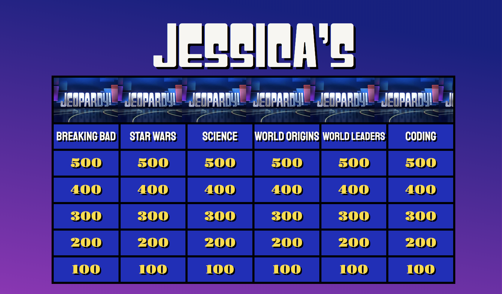
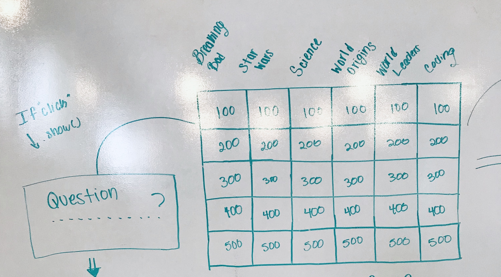

# Jessica's Jeopardy

General Assembly WDI 20 - Project 1

- Project:
- Trello Board: https://trello.com/b/wVet25tN/jeopardy-game
- Git Hub: https://github.com/JessicaBPerez/Jeopardy-Game.git

## Overview

The goal of this project was to utilize our skills in HTML, CSS, Javascript, and any related frameworks or libraries to build and style a web application using DOM manipulation.

## How To Play
1. Player One Enter's Name
2. Player Two Enter's Name
3. **Player One begins**: Look at the Categories and decide which topic and point card you would like to choose
4. Once **Player One** selects a card, the corresponding question will pop up with four answer choices. If you guess correctly, you earn the points; if you guess incorrectly, you lose the points
5. **Player Two begins**: Follow the same prompts as Player One
6. The players alternate turns and continue playing until there are no more questions on the Jeopardy Board
7. The player with the greatest amount of points at the end of the game wins

## Wireframe

## Technologies Used
1. Languages:
- HTML
- CSS
- JavaScript

2. Libraries:
- jQuery

## Future Developments/Improvements for Version 2
* Add intro animation with a "How To Play" slider card
* Add a ten second timer to each question
* Allow players to consequtively answer questions with a button buzzard
* Allow players to steal a turn
* Add a selection of Avatars for the players